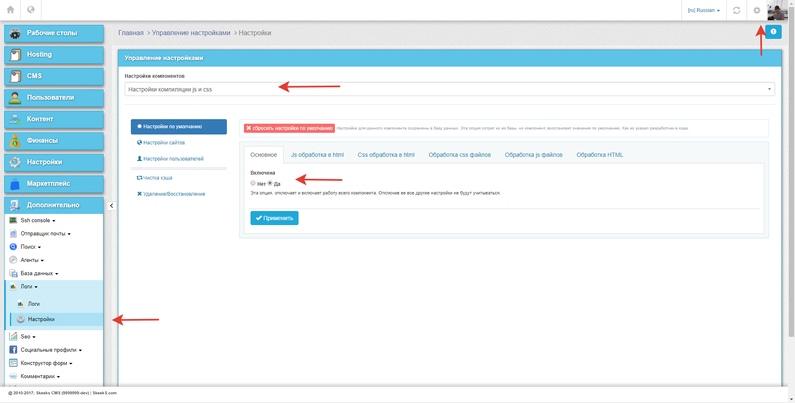

===
FAQ
===

Разные вопросы
==============

Тут временно публикуются различные полезные примеры, которые можно использовать на своих сайтах.
Куча разных несвязных примеров, которые могут быть полезны. Позже это будет структурированно и разнесено

Как правильно сделать resize изображений?
-----------------------------------------

Вот так можно получить ссылку на resize изображения.

.. code-block:: php

    echo \Yii::$app->imaging->thumbnailUrlOnRequest($model->image ? $model->image->src : null,
         new \skeeks\cms\components\imaging\filters\Thumbnail([
             'w' => 0,
             'h' => 200,
         ]), $model->code
    );

Как можно загрузить файл в хранилище?
-------------------------------------

Скачать с удаленного сервер и загрузить в хранилище

.. code-block:: php

    $imageUrl = 'http://test.ru/test.jpg';
    $element = \skeeks\cms\models\CmsContentElement::find(10);

    $file = \Yii::$app->storage->upload($imageUrl, [
        'name' => $element->name
    ]);

    $element->link('image', $file);

Как правильно поймать событие отправки формы в конструкторе
-----------------------------------------------------------

Чаще всего, возниает необходимость отлавливать события успешной отправки формы, и сообщать о них в yandex или google метрику.
Для этого предлагается использовать следующий код:

.. code-block:: php

    <?
    \yii\bootstrap\Modal::begin([
          'header' => 'Обратная связь',
          'id' => 'sx-feedback',
          'toggleButton' => false,
          'size' => \yii\bootstrap\Modal::SIZE_DEFAULT
      ]);
    ?>
        <?= \skeeks\modules\cms\form2\cmsWidgets\form2\FormWidget::widget([
            'form_code' => 'feedback',
            'namespace' => 'FormWidget-feedback',
            'viewFile' => 'with-messages',
            'successJs' => new \yii\web\JsExpression(<<<JS
            console.log('successJs');
            //yaCounter17836507.reachGoal('btn-send');
    JS
        ),
        'errorJs' => new \yii\web\JsExpression(<<<JS
            console.log('errorJs');
    JS
        ),
            //'viewFile' => '@app/views/widgets/FormWidget/fiz-connect'
        ]); ?>
    <?
        \yii\bootstrap\Modal::end();
    ?>

Как отметить обязательные поля в формах ``*``
---------------------------------------------

Для того чтобы добавить во все формы генерируемые стандартными средствами yii2, звездочки ``*`` обязтельных полей. Глобально на стринце можно подключить js и css.

.. code-block:: js

    $(function()
    {
        $('.form-group.required label').each(function()
        {
            $(this).append($('').text(' *'));
        });
    });

.. code-block:: css

    .sx-from-required
    {
        color: red;
        font-weight: bold;
    }

Как изменить timeout pjax?
--------------------------

Для того, чтобы изменить timeout pjax, глобально во всех виджетах pjax проекта, можно добавить код javascript:

.. code-block:: js

    $(function()
    {
        $.pjax.defaults.timeout = 30000;
    });
    
Как вызвать событие в момент окончания работы pjax-скрипта с определенным id?
-----------------------------------------------------------------------------

Для того, чтобы изменить вызвать событие в момент окончания работы pjax-скрипта, можно добавить код javascript:

.. code-block:: js

    $(document).on('pjax:complete', function (e) { 
    //любой pjax на странице закончился
       if (e.target.id == self.get('id')) { 
       //pjax с конкретным id закончился $(e.target)
       } 
    });

Оптимальный robots.txt
----------------------

.. code-block:: bash

    User-agent: *
    Disallow: /~*
    Disallow: /search*
    Disallow: *&SearchProductsModel*
    Disallow: *?SearchProductsModel*
    Disallow: *&SearchRelatedPropertiesModel*
    Disallow: *?SearchRelatedPropertiesModel*
    Disallow: *&ProductFilters*
    Disallow: *?ProductFilters*
    Clean-Param: from&_openstat&utm_source&utm_medium&utm_campaign&utm_content&utm_term&pm_source&pm_block&pm_position&clid&yclid&ymclid&frommarket&text
    Host: https://your-site.com
    Sitemap: https://your-site.com/sitemap.xml

Как включить js, css и html оптимизацию?
----------------------------------------

Для этих целей существуют дополнительное расширение, которое обычно уже стоит в базовых проектах.

`https://github.com/skeeks-cms/cms-assets-auto-compress <https://github.com/skeeks-cms/cms-assets-auto-compress>`_

Включение и настройка оптимизаций, проивзодится через систему управления сайтом:

Как подключить свой jquery в сайтовой части?
--------------------------------------------

Одним из вариантов может быть следующий пример:

В конфиг файле проекта ``@frontend/config/main.php`` добавить:

.. code-block:: php

    'components' =>
    [
        'view'    => [
            'on beforeRender' => function () {
                if (!\skeeks\cms\backend\BackendComponent::getCurrent()) {
                    \Yii::$app->assetManager->bundles['yii\web\JqueryAsset'] = [
                        'class' => '\frontend\assets\YourJqueryAsset',
                    ];
                }
            },
        ],
    ]

``frontend\assets\YourJqueryAsset`` :

.. code-block:: php

    namespace frontend\assets;

    /**
     * @author Semenov Alexander <semenov@skeeks.com>
     */
    class DigiproJsPluginsAsset extends DigiproAsset
    {
        public $sourcePath = '@webroot/';
        public $css = [];

        public $js = [
            'jquery-version.min.js',
        ];

        public $depends = [];
    }

Как задать основной хост проекта?
---------------------------------

.. code-block:: php

    'components' =>
    [
        'seo' => [
            'canUrl' => [
                'host' => 'main-host.com',
                'scheme' => 'https'
            ]
        ],
    ]

Перенос проекта на другой хостинг
=================================

Архивация
---------

Создать актуальный архив базы данных

.. code-block:: bash

    php yii dbDumper/mysql/dump

Создать архив вашего проекта

Восстановление
--------------

1. Скачать файлы проекта
~~~~~~~~~~~~~~~~~~~~~~~~
Развернуть архив, или склонировать проект из git репозитория

2. Установка composer и зависимостей
~~~~~~~~~~~~~~~~~~~~~~~~~~~~~~~~~~~~

.. code-block:: bash

    # Download latest version of composer in project
    curl -sS https://getcomposer.org/installer | COMPOSER_HOME=.composer php
    # Download dependency
    COMPOSER_HOME=.composer php composer.phar install -o

3. Configuring the database
~~~~~~~~~~~~~~~~~~~~~~~~~~~
Прописать коннект к базе данных `common/config/db.php`

4. Installation of migrations
~~~~~~~~~~~~~~~~~~~~~~~~~~~~~

.. code-block:: bash

    #Installation of ready-dump
    php yii dbDumper/mysql/restore

