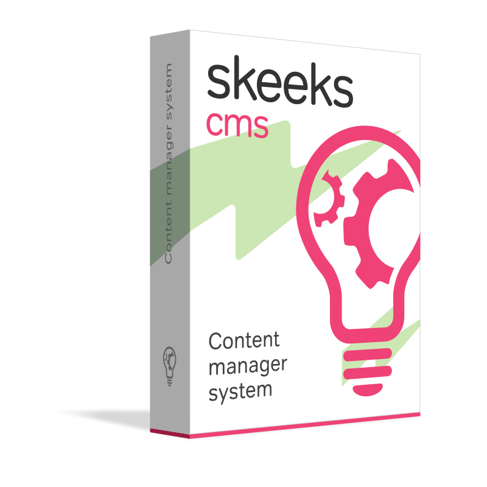

.. title:: SkeekS CMS's documentation

Welcome to SkeekS CMS's documentation!
======================================

SkeekS CMS - modern generic content management system based on yii2 php framework.

Links
~~~~~
* `Web site <https://cms.skeeks.com>`_
* `Author <https://skeeks.com>`_
* `ChangeLog <https://github.com/skeeks-cms/cms/blob/master/CHANGELOG.md>`_

Info
~~~~
It provides capabilities to manage site structure and content elements (news, publications, products, etc.).

Opportunities for management and dynamic creation of additional properties of the content sections and elements through the administration system.

Opportunities to manage users, privileges, roles and their purpose.

Supports single query entry point (one index.php), for backend and frontend parts of the project. By then, it is more convenient to configure nginx and apache.

Almost every page of the site - content item or section. Each of these models has some povdeniem availability of additional properties. Therefore, any product publkatsii, news, etc. It has a set of common properties, which are described in the model, and a set of dynamically created properties, through the administration system.

This versatility allows you to easily create any site, without writing and design of additional models and migration. What idelalno for quickly writing conventional nevysokonagruzhennyh projects (this does not mean that you can not write highly loaded projects).

Just have https://cms.skeeks.com/marketplace marketpleys the CMS for this, which is constantly updated with useful solutions.

.. toctree::
   :caption: Documentation for developers
   :maxdepth: 4

   overview
   structure
   quickstart
   admin
   extensions
   faq

